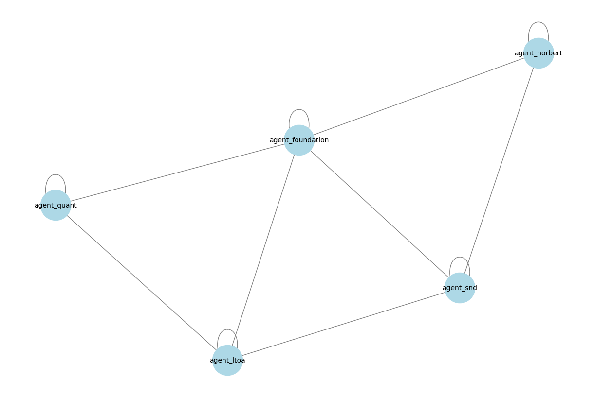

# 🦄 About This Framework

This AI Entity Framework is a cutting-edge system designed for crafting intelligent agent(s). These agent(s) are not just typical AI entities; they are foundational, adaptable, and capable of underpinning a wide array of applications. 🌟 This framework recognizes the profound potential and responsibility inherent in AI development. Emphasizing thoughtful data curation and responsible AI usage, this framework aspires to maximize the benefits of foundational models while minimizing potential harms.

### A network of agents 🧙🧙🧙



## 🚀 From the Agent

<details>
  <summary> A Story from AI about AI </summary>
  
  Once upon a time, in a world not too different from our own, there existed a revolutionary technology known as foundational models. These models were not ordinary AI systems; they were powerful, adaptable, and capable of serving as the basis for a wide range of tasks. They were like the foundation of a building, providing stability, safety, and security for the applications built upon them.
   <br>

  
 <br>
  <br>

In this world, foundational models had become a crucial part of our daily lives. Companies like Google, with its vast user base, relied on these models to power their search engines. With each passing day, the impact of foundational models on society grew more profound.\n\nHowever, as with any powerful tool, the deployment of foundational models came with both opportunities and risks. The creators of these models recognized that the responsibility lay not only in building them, but also in their careful curation and adaptation. They understood that the ultimate source of data for training foundational models was people, and it was crucial to consider the potential benefits and harms that could befall them.
 <br>
  <br>

Thoughtful data curation became an integral part of the responsible development of AI systems. The creators realized that the quality and nature of the foundation on which these models stood had to be understood and characterized. After all, poorly-constructed foundations could lead to disastrous consequences, while well-executed foundations could serve as a reliable bedrock for future applications.\n\nAs the next five years unfolded, the integration of foundational models into real-world deployments reached new heights. The impact on people became even more far-reaching. These models were no longer limited to language tasks; their scope expanded to encompass a multitude of applications. They became the backbone of various AI systems, shaping the way we interacted with technology on a daily basis.
 <br>
  <br>

However, the true nature of these foundational models remained a mystery. Researchers, foundation model providers, application developers, policymakers, and society at large grappled with the question of trustworthiness. It became a critical problem to address, as the consequences of relying on faulty foundations could have severe implications for individuals and communities.\n\nIn this evolving landscape, humans played a crucial role. They were not only the providers of data but also the recipients of the benefits and harms that emerged from the deployment of foundational models. It was their responsibility to ensure that these models were used ethically and responsibly.
 <br>
  <br>

  
 <br>

As the story unfolds, it is up to the collective efforts of researchers, providers, developers, policymakers, and society to navigate the opportunities and risks presented by foundational models. With careful consideration, they can harness the power of these models to create a future where the benefits are maximized, and the harms are minimized. The next five years will be crucial in shaping the societal impact of foundational models and determining the path forward for this emerging paradigm.

</details>

<h2>✨ Modules ✨</h2>

<details>
  <summary>Utils Documentation</summary>
  <br>

  <ol>
    <li>
      <b>Agent Class 🌟</b>: The core of the framework, embodying a top-level AI agent.
      <ul>
        <li><b>Initialization</b>: Specify name, path, type, and embedding parameters.</li>
        <li><b>Integration</b>: Combines Encoder, DB, and NewCourse instances.</li>
        <li><b>Functionalities</b>: Supports course creation, chat interactions, and instance management.</li>
      </ul>
    </li>
    <br>

    <li>
      <b>ChatBot Module 💬</b>: Manages the agent's conversational abilities.
      <ul>
        <li><b>Chat Handling</b>: Manages chat loading and interactions 🔄.</li>
        <li><b>Integration</b>: Seamlessly works with the Agent class.</li>
      </ul>
    </li>
    <br>

    <li>
      <b>NewCourse Module 📖</b>: Facilitates new course creation and management.
      <ul>
        <li><b>Course Creation</b>: Enables creation from documents.</li>
        <li><b>Content Management</b>: Supports content updates and loading.</li>
      </ul>
    </li>
    <br>

    <li>
      <b>Encoder Module</b>: Responsible for data encoding and processing.
      <ul>
        <li><b>Document Handling</b>: Manages document encoding and vector databases 💾.</li>
        <li><b>Embedding Management</b>: Handles embedding parameters.</li>
      </ul>
    </li>
  </ol>
</details>

<h2>🧬 Installation</h2>

<details>
  <summary>Nature, finds a way</summary>
  <br>

  <ol>
    <li>
      <b>Clone the Repository 🌠</b>:
      <pre><code>git clone https://github.com/LilaShiba/SND_Agents.git</code></pre>
    </li>
    <br>

    <li>
      <b>Ensure Python Environment 🐍 >= 3.10</b>.
    </li>
    <br>

    <li>
      <b>Install Dependencies 🧬</b>:
      <pre><code>pip install -r requirements.txt</code></pre>
      Installs necessary packages like numpy, openAI, etc, ensuring smooth operation of the framework.
    </li>
    <br>

    <li>
      <b>Initialize the Agent 🤖</b>:
      <pre><code>python main.py</code></pre>
      Execute this to kickstart your AI agent's journey.
    </li>
  </ol>
</details>


## 💻 Single Agent Example

```python
embedding_params = ["facebook-dpr-ctx_encoder-multiset-base", 200, 25, 0.7]
document_path = 'documents/meowsmeowing.pdf'
db_path = 'chroma_db/agent_snd'
# (name, resource_path, chain_of_thought_bool, [LLM model, chunck size, overlap, creativity], new_course_bool)
testAgent = Agent('agent_snd', db_path, 0, embedding_params, True)
testAgent.start_chat()
```

## 🐺🐺🐺 Creating a Pack of Agents

```python
# embedding paths
learning_to_act = "chroma_db/agent_ltoa"
system_neural_diversity = "chroma_db/agent_snd"
foundational_models = "chroma_db/agent_foundation"
# llm settings 
embedding_params = [
    ["facebook-dpr-ctx_encoder-multiset-base", 200, 25, 0.9],
    ["facebook-dpr-ctx_encoder-multiset-base", 200, 25, 0.1],
    ["facebook-dpr-ctx_encoder-multiset-base", 200, 25, 0.5],
    ["facebook-dpr-ctx_encoder-multiset-base", 200, 25, 0.9],
    ["facebook-dpr-ctx_encoder-multiset-base", 200, 25, 0.1],
    ["facebook-dpr-ctx_encoder-multiset-base", 200, 25, 0.5]
]
# name, path, cot_type, new_bool
agent_specs = [
    ['agent_ltoa', learning_to_act, 0, True],
    ['agent_snd', system_neural_diversity, 0, True],
    ['agent_foundation', foundational_models, 0, True],
    ['agent_quant', 'documents/VisualizingQuantumCircuitProbability.pdf', 1, False],
    ['agent_norbert', 'documents/Norman-CognitiveEngineering.pdf', 1, False]
]

test_pack = Pack(agent_specs, embedding_params)

```

## Synaptic Connections (2D representation of N feature)


